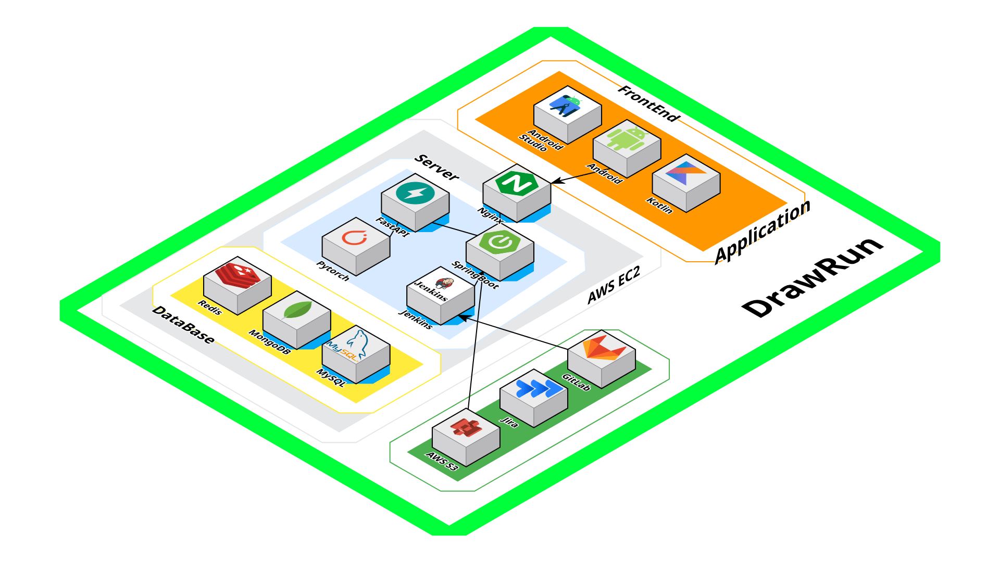

# SSAFY 12기 E208 다시마 - DrawRun

### 💡 당신의 발걸음으로 도시를 캔버스로, GPS 아트 러닝

 

## 목차

> - [👋 프로젝트 소개](#프로젝트-소개)
> - [📖 기획 의도](#기획-의도)
> - [👩‍👩‍👧‍👧 팀원 소개](#팀원-소개)
> - [📋 배포 링크](#배포-링크)
> - [✏️ 주요 기능](#주요-기능)
> - [🚩 시연 시나리오](#시연-시나리오)
> - [💻 아키텍쳐 구조도](#아키텍쳐-구조도)
> - [🖥️ 기술 스택](#기술-스택)
> - [🛠 Dependency](#Dependency)
> - [🔗 관련 링크](#관련-링크)

 

## 프로젝트 소개
 - 서비스 명: <b>Draw Run (드로우런) 
 - ✅ 러닝을 단순한 운동이 아닌 창작 활동으로 변화
 - ✅ 누구나 쉽게 참여할 수 있는 GPS 아트 기반 러닝 플랫폼
 - ✅ 전국 어디서든 창의적인 경로를 따라 달릴 수 있는 경험 제공
 - ✅ 커뮤니티기능을 통해 타 유저의 러닝경로 러닝 가능능

 

## DrawRun 기획 의도🎨 
### 1. GPS 아트 러닝의 국내 확산
- 해외에서 인기있는 GPS 아트 러닝을 국내에서도 쉽고 재미있게 즐길 수 있도록 지원하는 서비스
- 서울뿐만 아니라 전국 어디서나 GPS 아트 제작 가능
### 2. 러닝을 더욱 창의적으로 !
- 단순한 거리 달리기를 넘어, 내가 원하는 그림을 도로 위에 그리면서 운동
- 창의적인 GPS 경로 창작으로 러닝의 동기 부여 강화
### 3. 러닝 데이터 분석 & 기록 보관
- 사용자의 GPS 아트 경로, 거리, 평균 심박수, 페이스 등의 데이터를 저장
- 개인 러닝 히스토리를 시각화하여 운동 습관 관리 가능

 

## 팀원 소개 🫂
| 이름 | 역할 |
|:--:|:--:|
| 👑 **[송지영 (팀장)](https://github.com/xongeeuse)** | App (Android) |
| 🌟 **[김나영](https://github.com/skdud5126)** | App (Android) |
| 🎉 **[유지인](https://github.com/Yu-jiin)** | App (Android) & WearOS |
| 🐶 **[이동규](https://github.com/Iwannabegosu)** | Back-End (Spring) & Infra |
| ✏️ **[김성현](https://github.com/SeonghyeonKim)** | Back-End (Spring) & AI |

 

## 배포 링크

[DrawRun 다운로드하러 가기]()

 

## 주요 기능 🚀
### 1. 사용자 창작 경로  
 - 사용자가 직접 GPS 아트 경로를 설계하고 달리기 가능  

### 2. AI 경로 생성  
 - 직접 만들기 어려운 사람들을 위해 **AI가 자동으로 GPS 아트 경로 추천**  

### 3. 타유저의 경로 따라 달리기  
 - 다른 사용자가 만든 **GPS 아트 경로를 선택하여 함께 달리기**  

### 4. 러닝 기록 저장 & 분석  
- 개인 러닝 기록(거리, 소요 시간, 칼로리, 심박수 등)을 저장하고 분석  
- 운동 데이터를 시각화하여 **자신의 러닝 패턴을 확인 가능**  

### 5. 모바일 실시간 음성 네비게이션  
- **Mapbox 기반 실시간 내비게이션 및 음성 안내 지원**  
- 경로 이탈 시 **자동으로 재안내**  

### 6. WearOS 스마트워치 네비게이션  
- **WearOS 연동으로 손목에서 실시간 경로 안내 제공**  
- **스마트폰 없이도 지도 및 방향 안내 확인 가능**  

 

## 시연 시나리오

 

## 아키텍쳐 구조도

 

## 기술 스택

 

## Dependency

 

## 관련 링크

 

