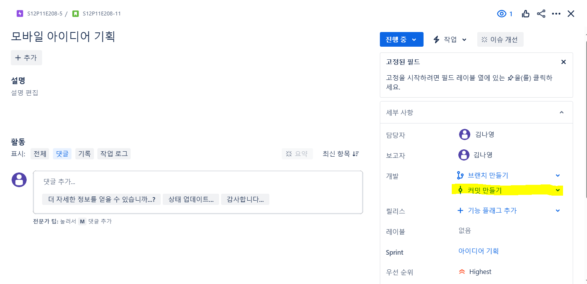
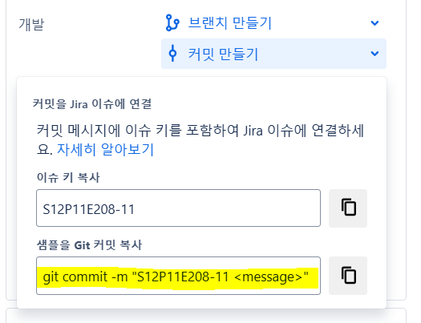
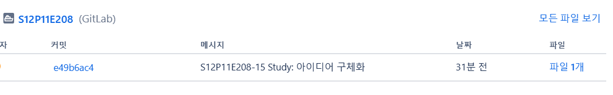

# 2025.01.15(수) 아이디어 기획 3일차

### 2차 미팅 후 아이디어 컨택 및 구체화

- 갤럭시 워치와 연동할 수 있고 모바일 기능을 최대로 끌어 올릴 수 있는 아이디어 선택

### 아이디어 구체화

- 초반에 기획했던 기능이나 아이디어를 구체화하기 위해 여러번의 팀 회의 진행

- 이 과정에서 아무래도 프로젝트 진행 인원이 많아지다보니 하나의 주제에 대해서 각각 이해하는 정도가 달랐고 소통이 중요하다는 것을 깨달음.

- 팀원들과 아이디어, 기능들을 구체화하면서도 이게 될까?싶기도 하면서도 세세하게 작업이 필요할 거 같다는 생각이 들었음.

### 요구사항 명세서 작성

- 노션에 개발에 필요한 기본 요구사항 명세서 작성하는 작업 진행

- 개발에 앞서 가장 중요한 작업임..! 구체화 가능

---

### `Jira`

- Jira에서 하위태스크에서 각자의 깃랩을 연결할 수 있다는 점...!

  

  

- jira에서 해당 백로그 번호가 적힌 커밋메세지를 복사해서 커밋을 하면 jira와 gitlab이 자동 연결된다.

```bash
// 코드 예시

$ git add .

$ git commit -m "S12P11E208-11 <각자 남길 커밋 메세지>"

$ git push origin "브랜치명"
```

- 각자 할당되는 백로그의 에픽 넘버와 함께 커밋메세지에 남겨 push 하면 jira와 자동 연결 성공 => jira에서 바로 확인 가능..!!

  

---

