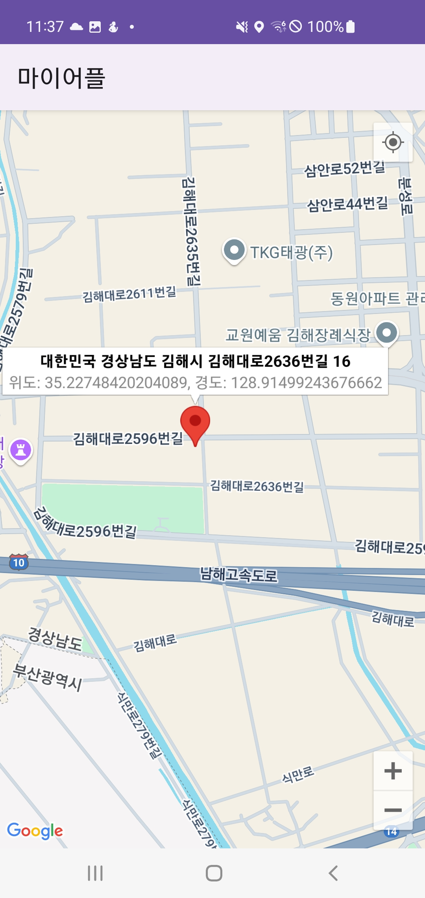

# 2025.01.29(수) 지도 데이터 테스트트 

### KPT 작성

#### `Keep` : 현재 만족하고 있는 부분, 계속 이어갔으면 하는 부분

- 팀원들과 원활한 소통

- 열정적인 팀원들(본인이 맡은 역할에 책임감 가지고 해내려고 열심히 노력함.)

- 포기하지 않는다는 마인드.

#### `Problem` : 불편하게 느끼는 부분, 개선이 필요하다고 생각되는 부분

- 다른팀들도 볼륨을 줄이고 있는 부분인데 연휴가 하루남은 시점에서 아직 뭘 제대로 해낸게 없으니까 우리도 볼륨을 줄여야 하나..

- 완성할 수 있나..?

#### `Try` : problem에 대한 해결책, 다음 회고 때 판별 가능한 것, 당장 실행 가능한 것

- 진짜 모바일 트랙에서 강의가 온라인이있고 오프라인있어서 멘붕왔었는데 해낸다는 광기 하나로 어떻게든 성공했다.. 내 위치로 좌표도 받아와지고 지도 어디서든 좌표 찍으면 그에 해당하는 주소와 위도,경도 받아옴.. 이정도면 진짜 큰 성과아닐까... 빛이 보여서 더 해낼 수 있을거같음... 다른팀위해서 힘내서 달려보자라는 마인드 생겼다..

- 진짜 할.수.있.다 뽜이팅!!

---